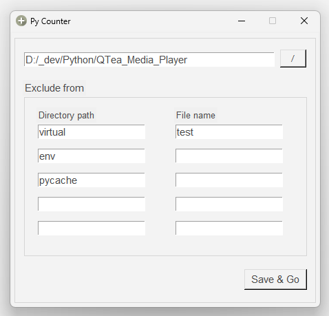
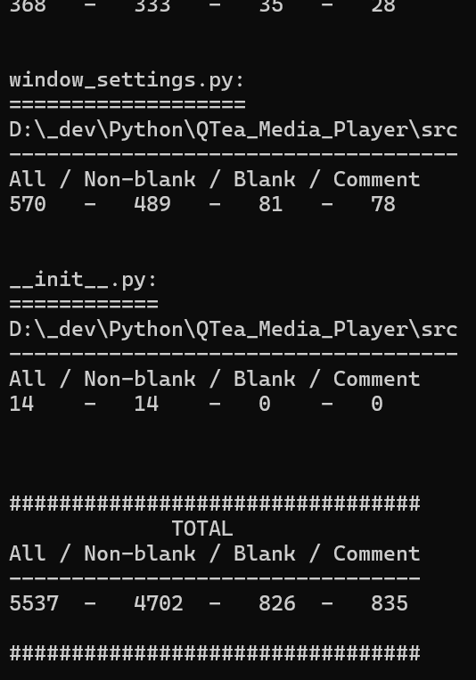

# Py Counter
Creates statistics of your Python script.

    

 

    

 

# Requirements
### Python 3 - used: 3.12.4
- https://www.python.org/

### OS
- Tested on Windows 11

## Thank you all who worked on the modules used in this project!